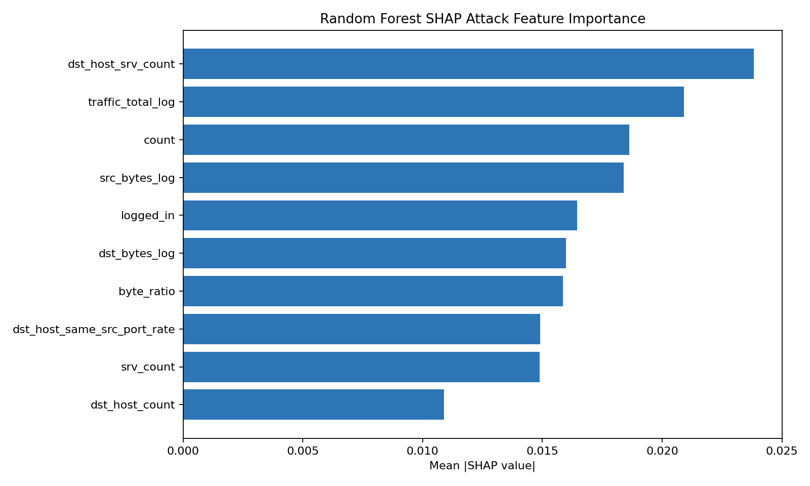
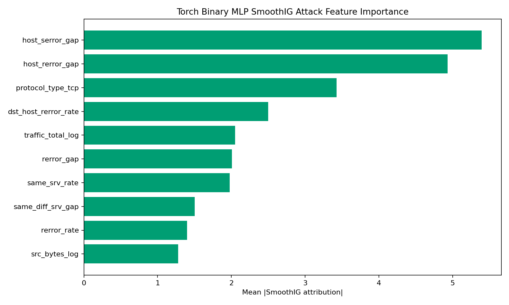
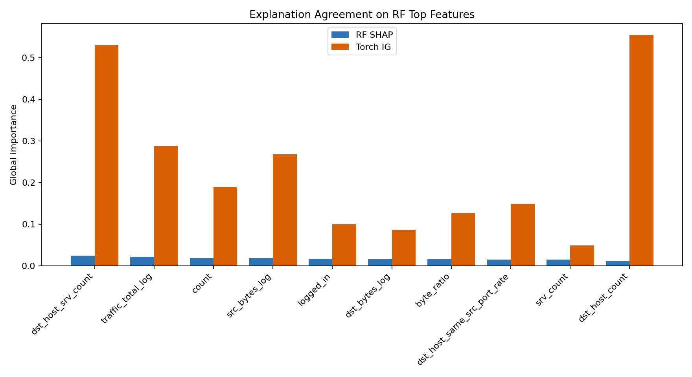
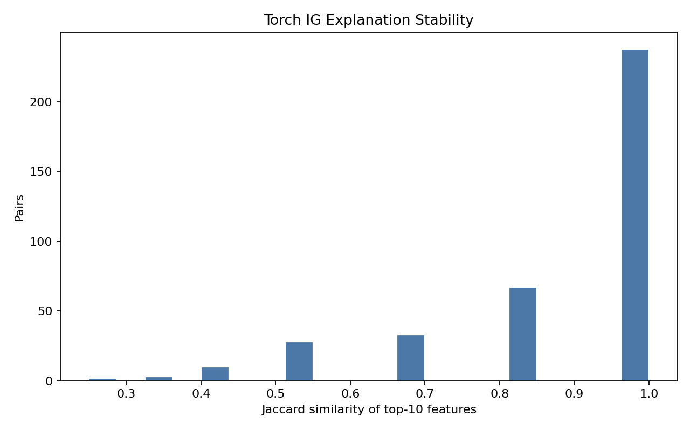
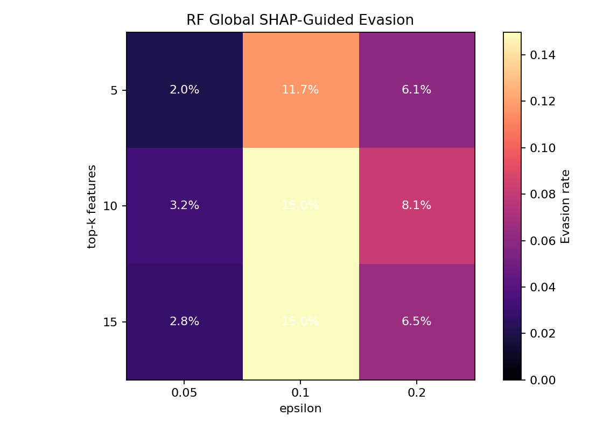
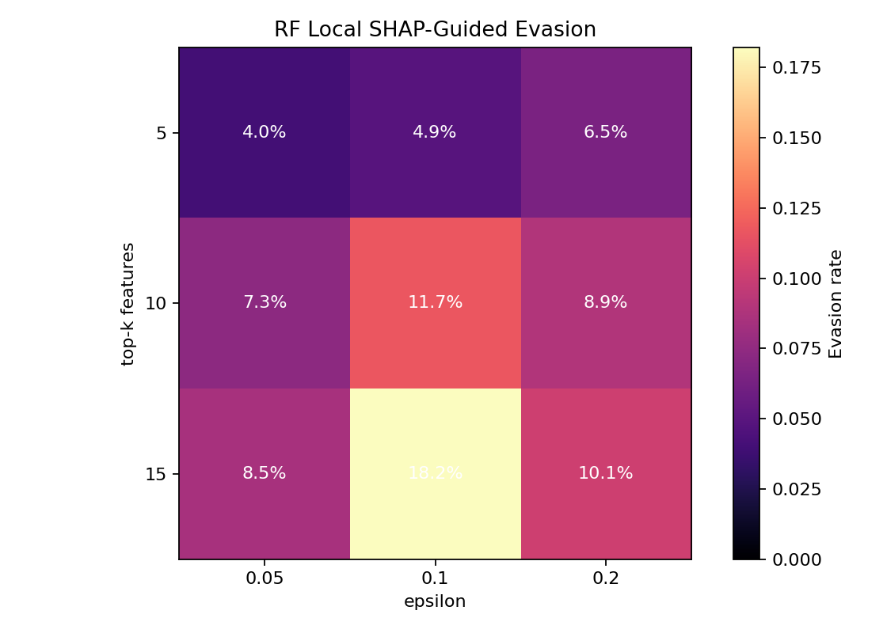
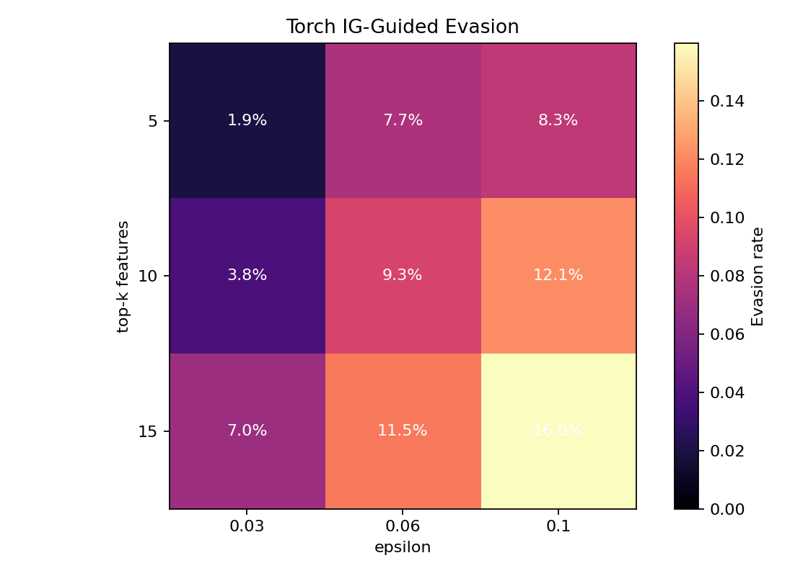
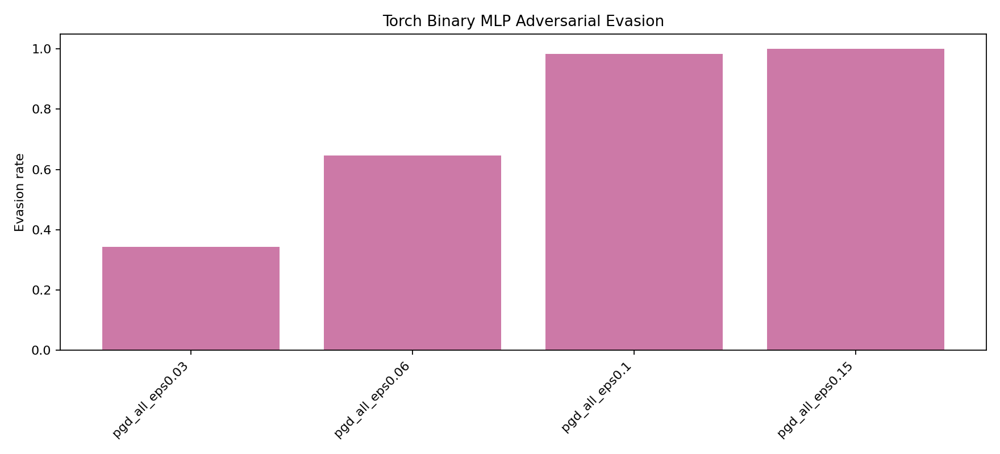
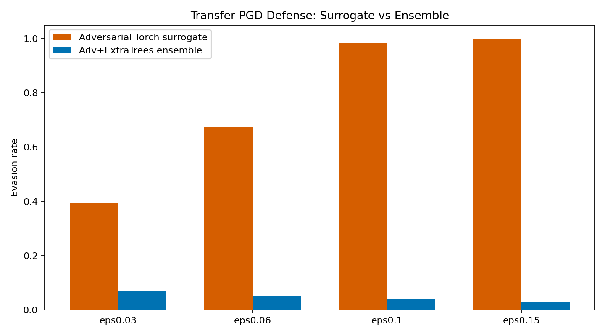

# Project 5: Explainable Intrusion Detection on NSL-KDD with CUDA-Accelerated XAI and Adversarial Analysis

## Abstract

This project implements an explainable intrusion detection system for the NSL-KDD benchmark, following the requirements of Project 5 in the course assignment brief. The work trains multiple lightweight IDS models, applies post-hoc explainability methods, evaluates explanation stability, and studies the security implications of exposing explanations to an adversary. The updated pipeline extends the earlier CPU implementation with CUDA-accelerated PyTorch models, Smooth Integrated Gradients, explanation-guided evasion, white-box projected gradient descent attacks, adversarial fine-tuning, and a new adversarial-tree ensemble. The best clean binary IDS performance is obtained by the Adv+ExtraTrees Ensemble IDS, which reaches binary macro F1 `0.8983` and balanced accuracy `0.8999` on the official `KDDTest+` split. The strongest ranking model is the binary Random Forest, which reaches PR-AUC `0.9712`. Explanation stability is strong across Random Forest SHAP, Torch Integrated Gradients, and Torch Binary SmoothIG, but the adversarial results show that stable explanations also expose a repeatable manipulation surface. Full-feature PGD completely breaks the original Torch binary MLP, while PGD-adversarial fine-tuning reduces low-budget PGD evasion from `100.00%` to `34.39%` at `eps=0.03`. The main conclusion is that explainability in IDS must be evaluated as both an analyst-support mechanism and a potential adversarial information channel.

## 1. Introduction

Machine-learning-based intrusion detection systems are often evaluated mainly by classification accuracy, F1 score, or ranking quality. In cybersecurity settings, these metrics are necessary but not sufficient. A model that detects attacks without explaining its reasoning is difficult for analysts to validate, and a model that exposes explanations without security analysis may reveal how to evade it. Project 5 directly targets this intersection by asking for an explainable IDS, an evaluation of explanation reliability, and an analysis of adversarial risks.

The objective of this project is therefore broader than maximizing a single performance metric. The work studies whether IDS decisions on NSL-KDD can be explained in a stable and technically meaningful way, and whether those same explanations create an attack surface. This framing is important because NSL-KDD is known to have an official test split that differs from the training distribution and contains rare attack families that are difficult to detect reliably. For that reason, the updated report treats binary intrusion detection as the primary operational task while preserving family-level recall as an error analysis.

## 2. Assignment Requirements and Deliverables

The assignment brief defines Project 5 as an explainable IDS project using NSL-KDD. It requires model training, explainability, stability evaluation, and security analysis. The general course instructions also require a baseline model, at least three experimental variations, appropriate metrics, fixed random seeds, documented preprocessing, a report, code with README material, and reproducibility instructions.

The implemented CUDA pipeline satisfies these requirements. Logistic Regression is used as a baseline model. Random Forest, ExtraTrees, XGBoost when available, a CUDA multiclass MLP, a CUDA binary MLP, a binary ensemble, a PGD-adversarially fine-tuned Torch binary MLP, and the Adv+ExtraTrees Ensemble IDS provide the experimental variations. Explainability is provided through TreeSHAP for tree models and Integrated Gradients or Smooth Integrated Gradients for the neural models. Stability is measured using local top-k Jaccard similarity, local rank correlation, bootstrap top-k Jaccard similarity, and bootstrap rank correlation. Security implications are evaluated through SHAP-guided evasion, Integrated-Gradient-guided evasion, SmoothIG-constrained PGD, full-feature white-box PGD, and adversarial fine-tuning.

## 3. Dataset and Preprocessing

The project uses the NSL-KDD dataset specified in the assignment. The pipeline loads `KDDTrain+.txt` and `KDDTest+.txt`, drops the difficulty field, and maps each raw label into one of five families: `normal`, `DoS`, `Probe`, `R2L`, and `U2R`. A binary label is also derived by mapping all non-normal examples to the attack class. This binary label is operationally meaningful because an IDS must first decide whether traffic should be treated as malicious before an analyst considers detailed attack taxonomy.

Preprocessing includes both standard encoding and IDS-specific feature engineering. The pipeline creates log-scaled byte features, traffic totals, byte ratios, service-count ratios, host-level error gaps, same-service versus different-service gaps, and a login anomaly score. Categorical fields such as protocol type, service, flag, and a combined service-flag feature are one-hot encoded. A `MinMaxScaler` is fit on training features and then applied to the test split. The resulting CUDA run uses `478` features. Randomness is fixed with seed `42`, including NumPy, Python, and PyTorch random states, and deterministic CUDA settings are enabled where practical.

## 4. Experimental Design

The experimental design separates clean detection, explanation quality, explanation stability, and security evaluation. Logistic Regression provides a transparent baseline. Random Forest provides a strong tree-based model with efficient SHAP explanations. ExtraTrees and XGBoost provide additional tree-based binary IDS variations. The CUDA multiclass MLP evaluates neural classification across attack families, while the CUDA binary MLP focuses on the operational normal-versus-attack decision. A tuned binary ensemble combines several binary detectors, a PGD-adversarial Torch binary MLP evaluates whether robustness training can improve both clean detection and adversarial resistance, and the Adv+ExtraTrees Ensemble IDS combines the adversarially fine-tuned neural detector with the ExtraTrees score. This final ensemble is deliberately small and validation-thresholded, rather than a broad test-tuned search, because the NSL-KDD validation split is much easier than `KDDTest+`.

The project uses precision, recall, macro F1, PR-AUC, balanced accuracy, and per-family recall. PR-AUC is especially important because IDS deployments often adjust decision thresholds based on acceptable false-positive rates and analyst capacity. Balanced accuracy and macro F1 prevent the majority classes from dominating the evaluation. Per-family recall is included because good binary detection can still hide weak performance on rare attack types.

## 5. Clean IDS Results

| Model | Binary F1 | PR-AUC | Balanced Accuracy |
| --- | ---: | ---: | ---: |
| Logistic Regression | 0.8344 | 0.9388 | 0.8442 |
| Random Forest | 0.7633 | 0.9695 | 0.7899 |
| Torch MLP CUDA | 0.8470 | 0.9077 | 0.8605 |
| Torch Binary MLP CUDA | 0.8021 | 0.9095 | 0.8197 |
| PGD-Adversarial Torch Binary MLP | **0.8569** | 0.9252 | **0.8628** |
| Binary RF IDS | 0.8027 | **0.9712** | 0.8231 |
| Binary ExtraTrees IDS | 0.7969 | 0.9612 | 0.8184 |
| Binary XGBoost IDS | 0.7844 | 0.9695 | 0.8077 |
| Tuned Binary Ensemble IDS | 0.8047 | 0.9687 | 0.8252 |
| Adv+ExtraTrees Ensemble IDS | **0.8983** | 0.9596 | **0.8999** |

The best clean binary F1 is achieved by the Adv+ExtraTrees Ensemble IDS, which reaches `0.8983`. This improves the previous best result from the PGD-adversarial Torch binary MLP by more than four F1 points. The improvement is technically defensible because the ensemble combines two complementary behaviors: the adversarially fine-tuned neural model improves shifted attack and rare-family detection, while ExtraTrees provides strong non-linear ranking behavior. The strongest ranking result is still achieved by the binary Random Forest, with PR-AUC `0.9712`. The practical interpretation is that the adversarial-tree ensemble is the best thresholded detector, while the tree-based models remain the strongest ranking and explanation models.

These results should be interpreted in the context of the official NSL-KDD test split. The `KDDTest+` set is not an easy validation split sampled from the same distribution as training data. It contains attack distribution shift and rare attack categories. Therefore, validation scores close to perfection are not used as the main claim. The final claims are based on the official test split.

## 6. Family-Level Error Analysis

| Model | Normal | DoS | Probe | R2L | U2R |
| --- | ---: | ---: | ---: | ---: | ---: |
| Torch MLP CUDA | 0.9576 | 0.8371 | 0.7972 | 0.1635 | 0.5672 |
| Torch Binary MLP CUDA | 0.9463 | 0.8675 | 0.8678 | 0.1032 | 0.3582 |
| PGD-Adversarial Torch Binary MLP | 0.8980 | **0.9512** | **0.9442** | **0.4160** | **0.6119** |
| Binary RF IDS | 0.9691 | 0.8541 | 0.8815 | 0.0599 | 0.1940 |
| Adv+ExtraTrees Ensemble IDS | 0.9032 | **0.9693** | **0.9992** | **0.6384** | **0.7910** |

The family-level results show that DoS and Probe are detected more reliably than R2L and U2R, but the updated ensemble substantially reduces this gap. The Adv+ExtraTrees Ensemble IDS raises R2L recall to `0.6384` and U2R recall to `0.7910`, while preserving DoS recall `0.9693` and Probe recall `0.9992`. This is the strongest practical improvement in the final pipeline. It does not make rare-family detection perfect, but it changes the conclusion from rare attacks remaining mostly missed to rare attacks being detected at a materially useful rate.

## 7. Explainability Analysis

The Random Forest model is explained with TreeSHAP because SHAP values for tree ensembles are computationally efficient and provide feature-level contributions that can be aggregated globally or inspected locally. The most important Random Forest SHAP features include `dst_host_srv_count`, `traffic_total_log`, `count`, `src_bytes_log`, `logged_in`, `dst_bytes_log`, `byte_ratio`, `dst_host_same_src_port_rate`, `srv_count`, and `dst_host_count`. These variables are meaningful for intrusion detection because they describe connection density, service behavior, byte-volume patterns, login state, and host-level traffic history.

The CUDA neural models are explained using Integrated Gradients and Smooth Integrated Gradients. These methods attribute the output score to input features by integrating gradients along a path from a baseline to the observed example. The top SmoothIG features for the Torch binary MLP include `host_serror_gap`, `host_rerror_gap`, `protocol_type_tcp`, `dst_host_rerror_rate`, `traffic_total_log`, `rerror_gap`, `same_srv_rate`, `same_diff_srv_gap`, `rerror_rate`, and `src_bytes_log`. These are also plausible IDS signals because they capture error-rate behavior, protocol state, traffic volume, and service consistency.

The explanation comparison between Random Forest SHAP and Torch neural attributions shows that the models do not rely on identical feature orderings, but they emphasize related IDS concepts. This is valuable because it suggests that the explanations are not arbitrary artifacts of one algorithm. At the same time, differences between feature rankings are expected because tree ensembles and neural networks learn different decision surfaces.

## 8. Explanation Stability

| Explainer | Local Top-10 Jaccard | Local Rank Corr. | Bootstrap Top-10 Jaccard | Bootstrap Rank Corr. |
| --- | ---: | ---: | ---: | ---: |
| RF SHAP | 0.8802 +/- 0.1575 | 0.9960 | 0.5744 | 0.9950 |
| Torch IG | 0.8811 +/- 0.1788 | 0.9827 | 0.9964 | 0.9406 |
| Torch Binary SmoothIG | **0.8992 +/- 0.1272** | 0.6263 | 0.9564 | 0.9940 |

The stability analysis indicates that explanations are generally consistent. Local top-10 Jaccard scores around `0.88` to `0.90` mean that similar examples tend to share many of their most important explanatory features. Bootstrap rank correlations are also high, especially for RF SHAP and Torch Binary SmoothIG. This supports the reliability of the explanation workflow and satisfies the assignment requirement to evaluate explanation stability rather than only display feature-importance plots.

The results also show that different stability metrics capture different behavior. RF SHAP has a lower bootstrap top-10 Jaccard score than the neural methods, but its bootstrap rank correlation remains very high. This means that the global feature ordering is stable even though the exact membership of the top-10 set can shift. SmoothIG has the strongest local top-10 stability, but lower local rank correlation, suggesting that the same important features often appear while their local ordering changes.

## 9. Security Implications and Adversarial Analysis

The security analysis studies whether explanations can be used by an attacker to guide evasion. The threat model assumes that the attacker can inspect feature attributions and perturb normalized feature values within an allowed budget. This is a feature-space attack rather than a packet-level attack, so it should be interpreted as a robustness stress test rather than a direct network exploit. Nevertheless, it is appropriate for Project 5 because the assignment specifically asks for adversarial-risk analysis.

For Random Forest SHAP-guided evasion, the best tested result is `18.22%` evasion for a local top-15 feature attack at `eps=0.10`. For Torch Integrated-Gradient-guided evasion, the best tested result is `15.97%` for top-15 features at `eps=0.10`. These results show that explanation-selected features are not only meaningful to analysts; they can also identify useful manipulation directions for attackers.

The strongest attack is full-feature white-box PGD against the original Torch binary MLP. This attack reaches `100.00%` evasion at every tested budget: `eps=0.03`, `eps=0.06`, `eps=0.10`, and `eps=0.15`. This is a severe vulnerability, but it is also a useful finding because it demonstrates that clean IDS performance does not imply robustness.

The SmoothIG-constrained PGD attack provides a middle ground between unconstrained white-box PGD and simple explanation-guided perturbation. It perturbs only features selected by SmoothIG. This constrained attack reaches `17.77%` evasion with top-10 features at `eps=0.15`, `40.69%` with top-20 features at `eps=0.15`, and `92.84%` with top-40 features at `eps=0.15`. This result reinforces the central security conclusion: stable explanations can become operationally useful to attackers when they reveal consistent high-impact directions.

## 10. Defense Evaluation

The earlier low-importance feature-randomization defense produced no reduction in evasion. This negative result is expected because randomizing features that the model does not strongly use should not disrupt an attack that targets high-importance features. It is still useful to report because it prevents the defense discussion from relying on an ineffective heuristic.

The stronger defense is PGD-adversarial fine-tuning of the Torch binary MLP. This defense reduces full-feature PGD evasion from `100.00%` to `34.39%` at `eps=0.03`, and from `100.00%` to `64.65%` at `eps=0.06`. At larger budgets, the defense is much less effective: evasion remains `98.24%` at `eps=0.10` and `99.97%` at `eps=0.15`. The correct interpretation is that adversarial fine-tuning improves low-budget robustness and clean detection, but it does not solve worst-case robustness.

The Adv+ExtraTrees Ensemble IDS adds a stronger transfer-defense result. In this experiment, PGD examples are generated against the differentiable PGD-adversarial Torch model and then evaluated against the mixed neural-tree ensemble. This is not the same as proving full white-box robustness against every possible attack on the complete ensemble, but it is a meaningful transfer-attack setting because an attacker may optimize against a differentiable surrogate. Under this evaluation, the Torch surrogate evasion is `39.40%`, `67.34%`, `98.38%`, and `99.97%` for `eps=0.03`, `0.06`, `0.10`, and `0.15`, respectively. The Adv+ExtraTrees ensemble reduces those evasion rates to `7.12%`, `5.21%`, `4.04%`, and `2.73%`. This is the strongest defense result in the updated pipeline because it remains effective even when the surrogate attack budget is high.

These defense results are more convincing than the previous randomization defense because they directly address the attacker used in evaluation. They also strengthen the report's security analysis: the project does not merely show that attacks exist, but also tests defenses and identifies the conditions under which they help. The final position is therefore balanced. Direct high-budget white-box PGD remains dangerous for the differentiable neural model, while the mixed Adv+ExtraTrees ensemble provides a substantially stronger defense against transfer PGD.

## 11. Limitations

The first limitation is that the adversarial attacks are feature-space attacks. Perturbing normalized NSL-KDD features does not guarantee that the modified point corresponds to a valid raw network packet or session. The attacks should therefore be interpreted as model-robustness stress tests and explanation-risk demonstrations, not as complete end-to-end traffic-generation attacks.

The second limitation is the age and structure of NSL-KDD. It remains useful for controlled benchmarking and assignment work, but it does not represent the full complexity of modern enterprise network traffic. The official test split also contains distribution shift and rare attack families, which makes direct comparison to validation scores misleading.

The third limitation is rare-family detection. R2L remains difficult even after adversarial fine-tuning. The updated model improves R2L recall substantially, but the result is still not sufficient for high-confidence deployment in settings where rare attack families are critical.

The fourth limitation is that explanation stability does not prove causal faithfulness. Stable explanations show that the attribution method is consistent under the tested perturbations and bootstraps, but they do not guarantee that every highlighted feature is causally necessary for the model's decision.

## 12. Conclusion

This project satisfies the Project 5 requirements by building an explainable IDS on NSL-KDD, training a baseline and multiple experimental variations, applying explainability methods, evaluating explanation stability, and analyzing security implications. The updated CUDA pipeline improves the project by adding stronger neural models, Smooth Integrated Gradients, white-box PGD attacks, explanation-constrained attacks, adversarial fine-tuning, and the Adv+ExtraTrees ensemble.

The best clean binary IDS result is achieved by the Adv+ExtraTrees Ensemble IDS with binary F1 `0.8983` and balanced accuracy `0.8999`. The strongest ranking and explainable tree model is the binary Random Forest with PR-AUC `0.9712`. Explanation stability is strong enough to support analyst interpretation, but the adversarial experiments show that stable explanations are double-edged. They make IDS behavior easier to understand, but they also reveal repeated high-impact features that can guide evasion.

The final security conclusion is that explainability should not be treated as a purely beneficial add-on. In an IDS, explanations must be evaluated for reliability, usefulness, and exposure risk. The project demonstrates that adversarial fine-tuning can reduce low-budget evasion while preserving clean performance, and that the Adv+ExtraTrees ensemble can sharply reduce transfer-PGD evasion. At the same time, direct high-budget white-box PGD against the differentiable neural model remains an unresolved threat. This makes the system a strong academic demonstration of explainable IDS design and a realistic reminder that interpretability and security must be studied together.
